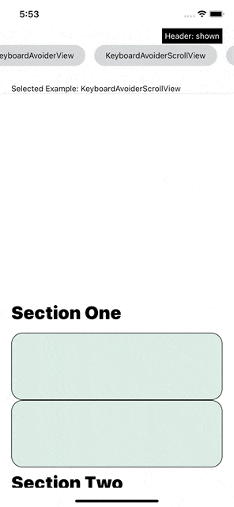
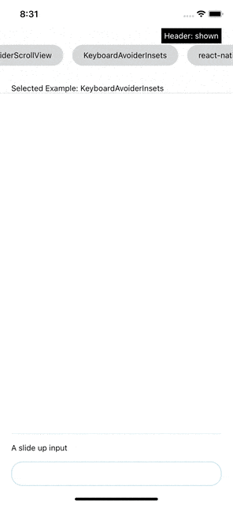
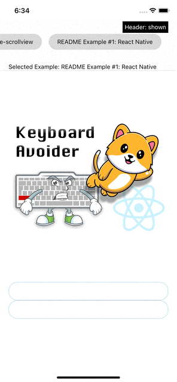
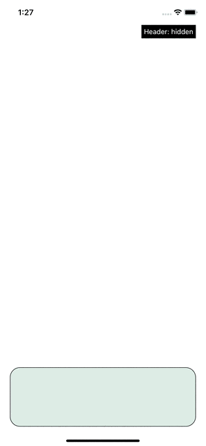
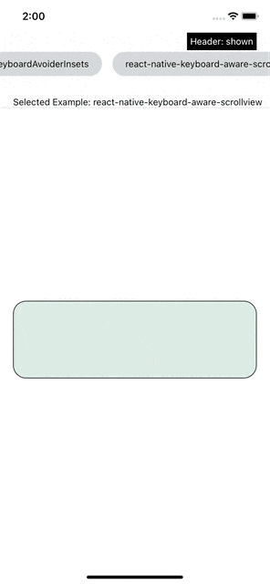

# Keyboard Avoiding (finally) made easy.
A modern, developer friendly React Native keyboard avoiding solution that actually works how it is supposed too all of the time and provides consistency across platforms. Provides a higher quality user experience and developer experience out of the box.

[API Reference](#api)

## Features
- Consistent cross platform behavior by default
- More responsive scroll view
    - Section based scrolling (show entire section when keyboard visible)
- Multiple behaviors that work with *any* layout
- Compatible with Expo
- Avoids pitfalls of similar libraries that lead to bad DX and bad UX. 
    - Comparison with React Native's [KeyboardAvoidingView](#comparison-with-keyboardavoidingview)
    - Comparison with [react-native-keyboard-aware-scroll-view](#comparison-with-react-native-keyboard-aware-scroll-view)
- Written in pure TypeScript

## Installation
This library requires `react-native-reanimated`

To install:

```sh
yarn add @good-react-native/keyboard-avoider react-native-reanimated 
```

If you aren't using Expo, make sure to add the `react-native-reanimated` Babel Plugin to `babel.config.js`:

```js
module.exports = {
    presets: [
      ...
    ],
    plugins: [
      ...
      'react-native-reanimated/plugin',
    ],
};
```

### iOS
Install cocoapods: 
```sh
cd ios && pod install
```

### Android
Make sure your Android keyboard avoiding behavior is set to `adjustPan` (this library assumes it is). If you're in a bare workflow, add this line to your `android/app/src/main/AndroidManifest.xml`:
```xml
<activity
    android:windowSoftInputMode="adjustPan"
>
```

If you're using Expo, you will instead add this to `app.json`

```json
  "expo": {
    "android": {
      "softwareKeyboardLayoutMode": "pan"
    }
  }
```

## Usage
First, you need to wrap your app in `KeyboardAvoiderProvider`:

```jsx
export const App = () => (
  <KeyboardAvoiderProvider>
    <RestOfApp/>
  </KeyboardAvoiderProvider>
);
```


## Components
This library has three primary components that make implementing keyboard avoiding behavior easy. 

### 1. `KeyboardAvoiderView`
A view that simply gets out of the way of the keyboard regardless of what the rest of your screen and layout looks like:

```jsx
export const MyScreen = () => (
  <View style={{flex: 1}}>
    <View style={{flex: 1}}/>
    <KeyboardAvoiderView>
        <TextInput>
    </KeyboardAvoiderView>
  </View>
);
```
It wont break the rest of your layout, it's easy to understand, it just works.

[KeyboardAvoiderView API](#keyboardavoiderview-props)

### 2. `KeyboardAvoiderScrollView`
A more responsive keyboard aware `ScrollView` that behaves predictably:
```jsx
export const MyScreen = () => (
  <KeyboardAvoiderScrollView contentContainerStyle={{flexGrow: 1}}>
    <View style={{flex: 1}}/>
    <TextInput/>
  </KeyboardAvoiderScrollView>
);
```

[KeyboardAvoiderScrollView API](#keyboardavoiderscrollview-props)

### Section based scrolling
Optionally, you can create a section based scroll with the `KeyboardAvoiderScrollSection` component:


```jsx
export const MyScreen = () => (
  <KeyboardAvoiderScrollView contentContainerStyle={{flexGrow: 1}}>

    <View style={{flex: 1}}/>
    <KeyboardAvoiderScrollSection>
        <TextInput/>
        <TextInput/>
    </KeyboardAvoiderScrollSection>
  </KeyboardAvoiderScrollView>
);
```

This makes it where the entire section will by shown when any input within that section is focused:



### 3. `KeyboardAvoiderInsets`
A component that creates keyboard avoiding insets. 
```jsx
export const MyScreen = () => (
  <KeyboardAvoiderScrollView contentContainerStyle={{flexGrow: 1}}>
    <View style={{flex: 1}}/>
    <TextInput/>
  </KeyboardAvoiderScrollView>
);
```

You can use this when you need some space to be created within a layout when the keyboard shows (like if you had a keyboard attached to the bottom of the screen):



[KeyboardAvoiderInsets API](#keyboardavoiderinsets-props)

## Comparison with KeyboardAvoidingView
The biggest issue with the React Native's `KeyboardAvoidingView` is that, as a developer, it's hard to reason about how the behaviors will end up functioning within a screen and doesn't work in all layouts (even when it should work probably work). For example, lets look at a very simple layout:
```jsx
function DoesntWork() {
    return (
        <View style={{
            flex: 1,
        }}>
            <View
                style={{
                    height: Dimensions.get('window').height - 300,
                    width: '100%',
                    justifyContent: 'flex-start'
                }}
            />
            <KeyboardAvoidingView
              behavior='padding' // None of the three supported behaviors will work here. That's bad.
            >
                <TextInput
                    style={textInputStyle}
                />
                <TextInput
                    style={textInputStyle}
                />
            </KeyboardAvoidingView>
        </View>
    )
}
```



`KeyboardAvoidingView` is not even able to avoid a keyboard in this very simple situation! None of its three behaviors will work here. That's crazy. This is a normal layout and it should be supported.

What if we just had a keyboard avoiding view that actually worked all the time, predictably? Well, now we do:


```jsx

export function ReactNativeFixedExample() {
    return (
        <View style={{
            flex: 1,
        }}>
            <View
                style={{
                    height: Dimensions.get('window').height - 400,
                    width: '100%',
                    justifyContent: 'flex-start'
                }}
            >
                <Image
                    style={{
                        width: '100%',
                        height: '100%',
                        resizeMode: 'contain'
                    }}
                    source={require('../promo-image.png')}
                />
            </View>
            <KeyboardAvoiderView>
                <TextInput
                    style={textInputStyle}
                />
                <TextInput
                    style={textInputStyle}
                />
            </KeyboardAvoiderView>
        </View>
    )
}
```


Our `KeyboardAvoiderView` will work in every situation, and it's never going to break your layout because it uses translations instead of animating properties that affect your layout such as height and padding. It's just a view that gets out of the way of the keyboard in a predictable way.

If you do need to alter the layout itself, then you can use our [KeyboardAvoiderInsets](#3-keyboardavoiderinsets) for all such use cases.

### No "behavior" prop
Unlike `<KeyboardAvoidingView/>` `behavior` prop, `<KeyboardAvoiderView/>` `avoidMode` doesn't make you think about implementation details. Instead, it simply tells the `<KeyboardAvoiderView/>` where you would like it to move when the keyboard shows.

## Comparison with react-native-keyboard-aware-scroll-view

Part of the motivation for creating this library was to attempt to create a scroll view that fixed many of the issues found in `react-native-keyboard-aware-scroll-view`.

### Better user experience
More responsive behavior. `react-native-keyboard-aware-scroll-view` doesn't scroll fast enough to avoid the keyboard:



And it can act janky in certain circumstances:



Our `<KeyboardAvoiderScrollView/>` does exactly what it should in all situations, it just gets the input out of the way with a smooth animation:


There is a noticeable UX improvement on Android as well.

### Consistent keyboard avoiding within your application
Keyboard avoiding will look the same both within and outside of scroll views. Extra height is always applied consistently.

### Less glitchy
No "bounce glitch". Unfortunately, this is a glitch that has existed for years in `react-native-keyboard-aware-scroll-view` and it likely isn't going to be fixed any time soon: https://github.com/APSL/react-native-keyboard-aware-scroll-view/issues/217

There is simply no way to reliably avoid the "bounce" if you're using `@react-navigation` (although you may be able to avoid it in some cases, it probably can't be solved for all).

React Native's KeyboardAvoidingView has been reported to have issues with this as well. Our library avoids any such issues by measuring the absolute position of elements on the screen.

### Section based scrolling 
This library allows for automatic scrolling to show entire views instead of only allowing scrolling to text inputs if the developer wants it. This feature can be used to create a better user experience if desired:


## Cross Platform Differences
This library aims to provide consistent behavior between platforms by default, but having matching behavior is impossible in some cases because Android doesn't allow developers to disable system keyboard avoiding behavior without disabling keyboard events entirely.

One noteable default difference is that on iOS, `<KeyboardAvoiderScrollView/>` will attempt to stay still when the keyboard hides. This behavior can be disabled so that the cross platform behavior matches, via the prop `iosHideBehavior='revert'`.

## Contributing
If this library is missing some feature that you'd find valueable, please open an issue! We're hoping the community can help guide us in deciding which features to add next to this package and are very open to suggestions at the moment. And we would like to avoid adding any features that we aren't sure have value to developers.

For developer convenience, this repo is a React Native project. You can just pull it down and work within the project. Pull requests should only touch the `src` folder.

# API

## Props

### Common props
All of the components support the following props:

| **Props**       | **Type**                | **Description**                                                                                                                                                                               | **Default** |
|-----------------|-------------------------|-----------------------------------------------------------------------------------------------------------------------------------------------------------------------------------------------|-------------|
| animationTime   | number                  | Time to move the view out of the way when the keyboard opens.                                                                                                                                 | 150         |
| animationEasing | Animated.EasingFunction | Easing function to use for both opening and closing animation.<br>Opening animation will use `Easing.out(animationEasing)`, while closing animation<br>will use `Easing.in(animationEasing)`. | Easing.quad |
| extraSpace      | number                  | How much space there should be between the keyboard avoiding element and the keyboard.                                                                                                        | 20          |

### `KeyboardAvoiderView` Props
Supports all React Native `View` props as well as all [common props](#common-keyboardavoider-props).

Additionally, it supports the following props

| **Props**     | **Type**                        | **Description**                                                                                                                                                     | **Default**  |
|---------------|---------------------------------|---------------------------------------------------------------------------------------------------------------------------------------------------------------------|--------------|
| avoidMode     | 'whole-view'<br>'focused-input' | Which avoid mode to use.<br>'whole-view' will move the entire view out of the way.<br>'focused-input' will move just enough to show the input plus the extra space. | 'whole-view' |
| enableAndroid | boolean                         | Enable keyboard avoiding on Android.                                                                                                                                | true         |


### `KeyboardAvoiderScrollView` Props
Supports all React Native `ScrollView` props as well as all [common props](#common-keyboardavoider-props).

Additionally, it supports the following props

| **Props**       | **Type**           | **Description**                                                                                                                                                                                            | **Default** |
|-----------------|--------------------|------------------------------------------------------------------------------------------------------------------------------------------------------------------------------------------------------------|-------------|
| iosHideBehavior | 'stay'<br>'revert' | Behavior when the keyboard hides on iOS.<br>'stay' makes it where the scroll view stays where it is when the keyboard closes.<br>'revert' makes it where the scroll view returns to its original position. | 'stay'      |

### `KeyboardAvoiderInsets` Props
Supports all [common props](#common-keyboardavoider-props).